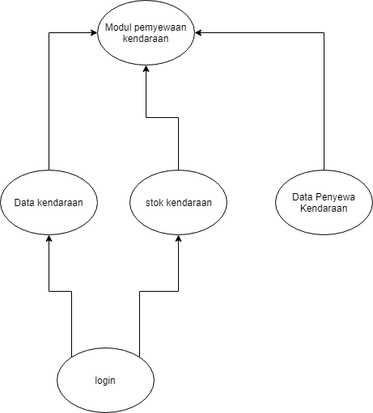

### BAB 1

### PENDAHULUAN

__1.1 Gambaran Proyek__

Pada proyek ini kami membuat Aplikasi Penyewaan dan Guide Transportasi.

__1.2 Dokumen - Dokumen Dalam Proyek__

Dokumen yang akan digunakan dalam proyek antara lain: 1. SPMP (Software Project Management Plan) 2. SRS (Software Requirements Specification)

__1.3 Evolusi SPMP__

Dokumen ini dirawat oleh masing-masing anggota sesuai dengan tanggung jawabnya. Dimana pada SPMP ini setiap anggota bertanggung jawab pada satu bab.

__1.4 Material Acuan__

__1.5 Definisi dan Akronim__

* Definisi

__Sistem__ : Suatu kesatuan yang terdiri komponen atau elemen yang dihubungkan bersama untuk memudahkan aliran informasi, materi atau energi untuk mencapai suatu tujuan.

__Aplikasi__ : Suatu program komputer yang dibuat untuk mengerjakan dan melaksanakan tugas khusus dari pengguna.

__Penyewaan__ : Sebuah persetujuan di mana sebuah pembayaran dilakukan atas penggunaan suatu barang atau properti secara sementara oleh orang lain. Barang yang dapat disewa bermacam-macam, tarif dan lama sewa juga bermacam-macam.

* Akronim

## 2. Organisasi proyek

__2.1 Model Prosess__
aplikasi ini berbasis pernagkat lunak

__sistem ini__

__2.2 Struktur Organisasi__
Project manager
programer
analisis
__2.3 Batasan dan antarmuka organisasi__
Project manager yang bertanggung jawab penuh pada prject yang kita buat
programer yang bertanggung jawab membuat dan menyempurnakan program
analisis bertanggung jawab memberikan gmabaran project dan alur pengkodingan pada programer

__2.4 Lingkup tanggung jawab__
__Penjelasan__
lingkup dan tanggung jawab ini berisi tugas dari setiap elemen anggota dalam pembuatan proyek ini
project manager :seseorang yang mempunyai tanggung jawab dan tugas yang besar dalam sebuah tim tidak hanya fokus pada hal-hal yang teknis sifatnya manager juga harus memenjemen tim dengan baik agar target project tercapai. selain itu beri pengarahan, memonitoring kinejrha tim serta membagi tugas juga bagian tanggung jawab dari seorang manager
Programer :Dalam hal ini, seorang programer bertugas unutk mengimplementsikan dari sistem yang sudah dirancang didesaign . programer dituntut dalam penulisan code program dengan baik, dan efesien . hal ini dimaksudkan menghindari terjadi nya banyak oror dalam proses implentsinya.
Ananlisis :Banyak hal yang harus dilakukan oleh seorang analisis, terutama yang berkaitan dengan pemecehan maslah. seorang sistem analisis harus mampu menganalisa segala kemungkinan dari permaslahan yang ada, dan dapat menghasilkan solusi yang tepat dari permasalahan tersebut. menentukan sistem yang tepat merupakan bagian dari tugas seorang analiss, sehingga kinerja tim dapat berjalan secara efesien

### BAB 3
### Proses Manajerial

__3.1 Tujuan dan Prioritas Manajemen__

Tujuan dari proyek ini adalah untuk megembangkan sistem penyewaan transpotasi sesuai anggaran , waktu, dan kualitas yang ditentukan. Proyek ini sangat di prioritaskan karena memberi manfaat yang tinggi bagi masyarakat yang ingin meyewa kendaraan dan proyek ini juga menyediakan guide untuk membantu masyarakat mengenali tempat-tempat wisata yang ingin di tuju.

__3.2 Asumsi, Keterkaitan dan Batasan-Batasan__

* __Asumsi__
Perusahaan jasa rental mobil dapat menciptakan dan meningkatkan kepuasan konsumennya. Strategi pemasaran yang telah dilaksanakan selama ini dirasakan kurang efektif sehingga menyebabkan keuntungan yang diperoleh tidak maksimal karena fluktasi jumlah penjualan dari waktu ke waktu. Hal ini diindikasikan karena adanya tingkat kepuasan konsumen yang rendah. Dengan demikian, kami berusaha meningkatkan cara - cara pemasaran dan membuat aplikasi penyewaan transportasi yang lebih efektif agar dapat meciptakakn dan meningkatkakn kepuasan konsumen sehingga dapat merebut juga sekaligus mempertahankan pelanggannya demi kelangsungan hidup perusahaan.

* __Batasan-Batasan__
Penelitian dilakukan dengan batasan - batasan tertentu agar tidak menyimpang dari permasalahan yang ada. Dalam penelitian ini, membatasi pada masalah strategi pemasaran jasa meliputi product, harga, tempat, promosi, orang, sarana fisik, dan proses, yang berpengaruh terhadap kepuasan konsumen dalam meggunakan jasa sewa kendaraan

__3.3 Manajemen Resiko__

* Manajemen keuangan
* Manajemen Armada atau Mobil
* Manajemen Administrasi
* Manajemen Pelanggan

__3.4 Mekanisme Monitoring dan Kontroling__

* Rapat proyek mingguan
* Penyimpanan dokumen bersama
* Perencanaan Proyek
* Pencarian manfaat dalam proyek

__3.5 Perencanaan Staf__

* Planning ( perencanaan )
* Menganalisis
* Mendesain
* Mengimplementasikan

### BAB 5
### Paket Pekerjaan, Jadwal dan Budget

__5.1 Paket Pekerjaan__

- ANNISA KARTIKA UTAMI
- ARI IRAWAN
- IMAM MUHAYAT
- HASRI HABBEANA PERTIWI
- ADE KARTONO
		

| Nama | JobDesk | Rincian Pekerjaan |
| ----------- | :---------: | ----------: |
| Annisa Kartika Utami | Design | Isi 3 - 1 |
| Ari Irawan | Analysis | Isi 3 - 2 |
| Imam Muhayat | Projek manager | Isi 3 - 3 |
| Hasri Habbeana Pertiwi | Programmer | Isi 3 - 3 |
| Ade Kartono | Programmer | Isi 3 - 3 |
	

Kategori Kegiatan :

- Penentuan judul proyek dan pengumpulan sumber daya yang diperlukan
- Membuat proposal dan pengajuan ke mitra
- Pencarian referensi dan pengerjaan projek
- Pengecekan aplikasi dan implementasikan hasil projek
- Melakukan Perbaikan jika terjadi kesalahan
- Melaksanakan persentasi projek

__5.2 Ketergantungan dan Keterkaitan__

__5.3 Kebutuhan-Kebutuhan Sumber Daya__

5.3.1 Kebutuhan Sumber Daya Manusia

- Annisa Kartika Utami
- Ari Irawan
- Imam Muhayat
- Hasri Habbeana Pertiwi
- Ade Kartono

5.3.2 Kebutuhan Sumber Daya Software

- Android studio
- Mysql
- emulator

5.3.3 Kebutuhan Sumber Daya Hardware

- Pc/Laptop
- flashdrive
- ponsel/smartphone

__5.4 Alokasi Budget dan Sumber Daya__

__5.5 Jadwal__
